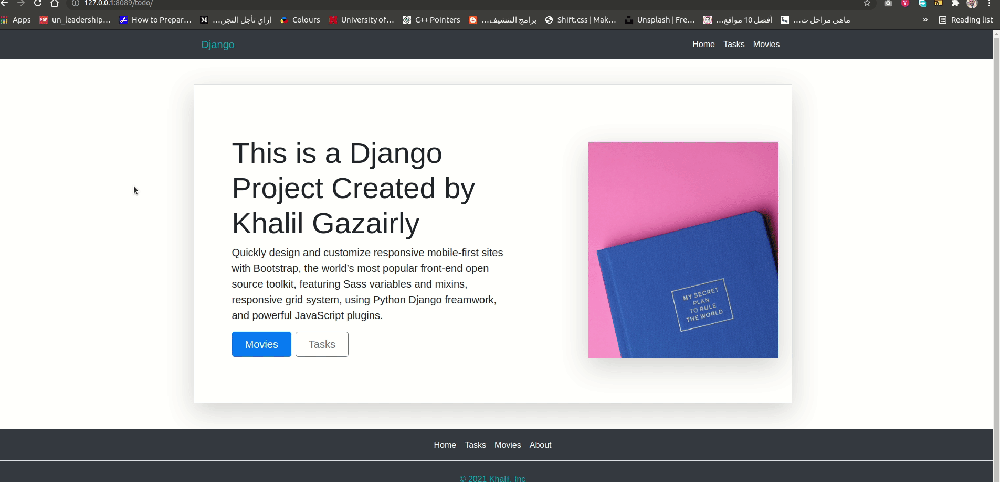
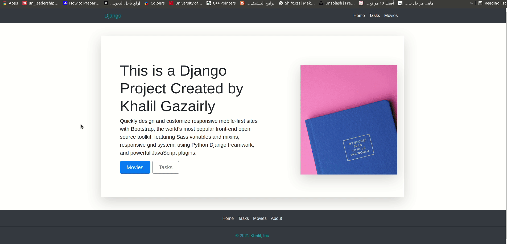
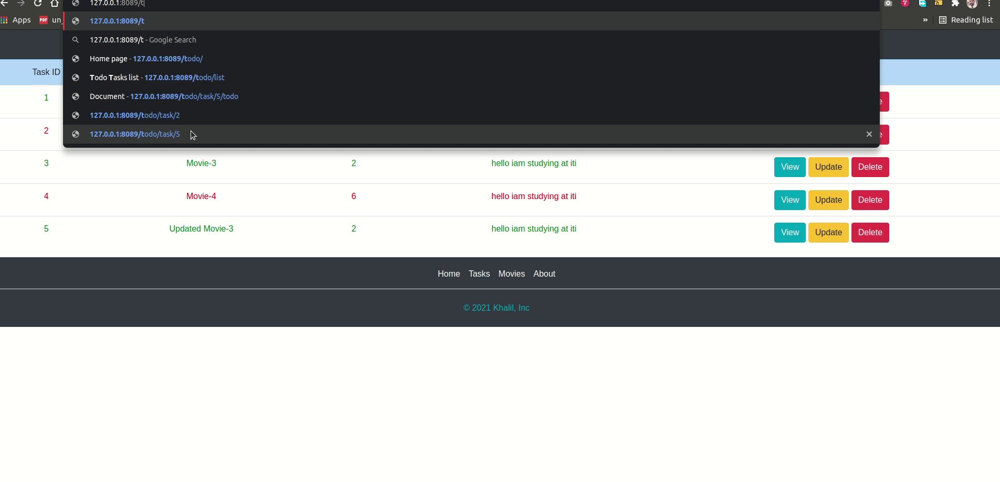
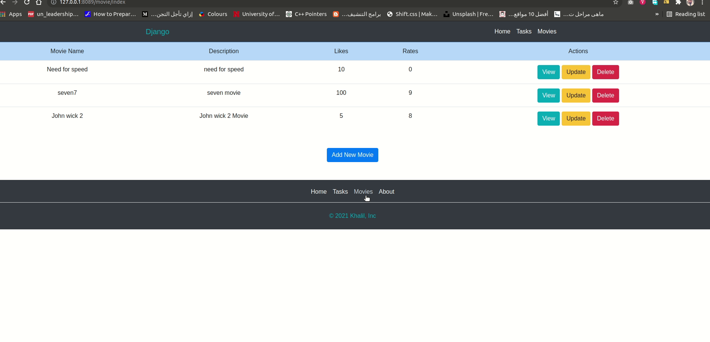

# crud_django
This is a crude django project contain:
   Installing Django & start our first project
   Application files & structure
   Urls & Views
   Templates
   Template Inheritance
   Custom template tags & filter
   
   Static files handling
   Models
   ORM
   Admin Panel
   Forms
   Media files handling

   Customize Admin Panel
   Authentication
   Signals
   Django Mail backend
   MiddleWare
   
   And this is a screen from localhost
   
   
   
   
   
   
   
   
