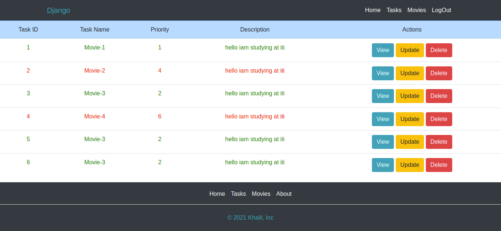

# crud_django
## Table of contents
* [General info](#general-info)
* [Covered topic](#Covered-topic)
* [Screens](#screens)

## General info
This is a crude django project contain Task todo list and Movies.
	
## Covered topic
Project is created with:
* Installing Django & start our first project
* Urls & Views
* Templates
* Template Inheritance
* Custom template tags & filter
* Static files handling
* Models
* ORM
* Admin Panel
* Forms
* Media files handling
* Customize Admin Panel
* Authentication
* Signals
* Django Mail backend
* MiddleWare
	

   
   ## screens
   And this is a screen from localhost
   

   

 

   

 

   

 

   

 

   

 

   

 

   

 
   
   

 
   
   

 
   
   

 

